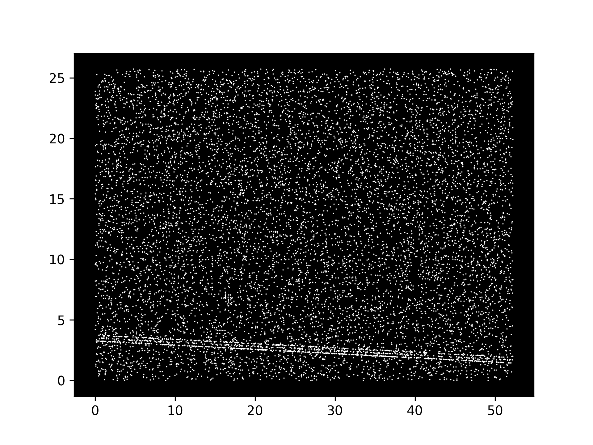
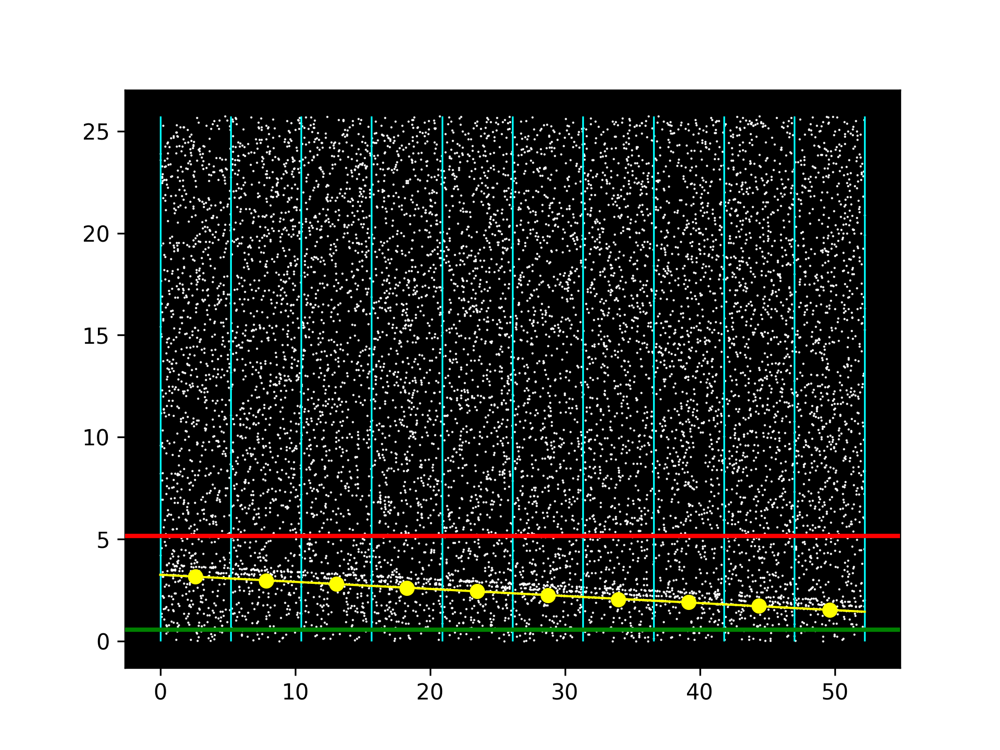
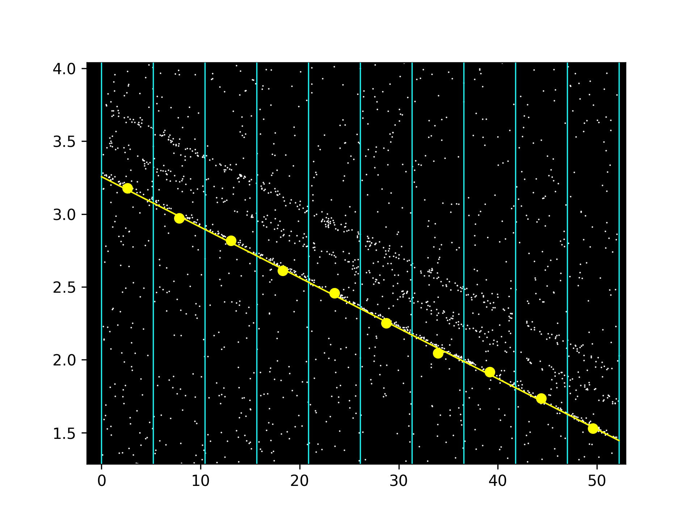
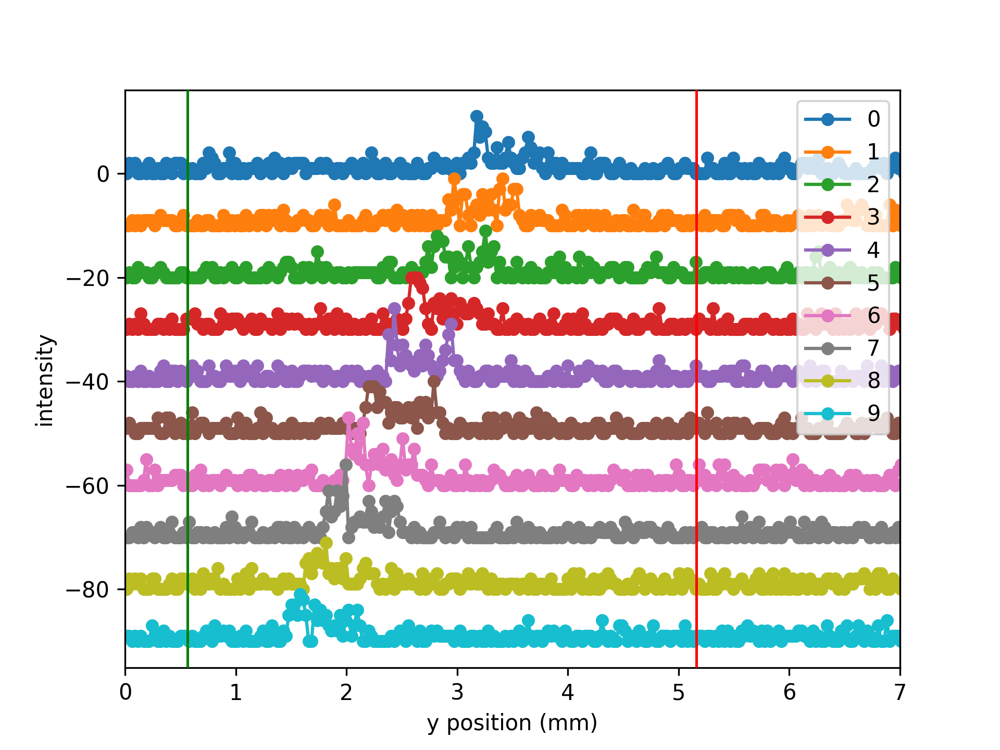
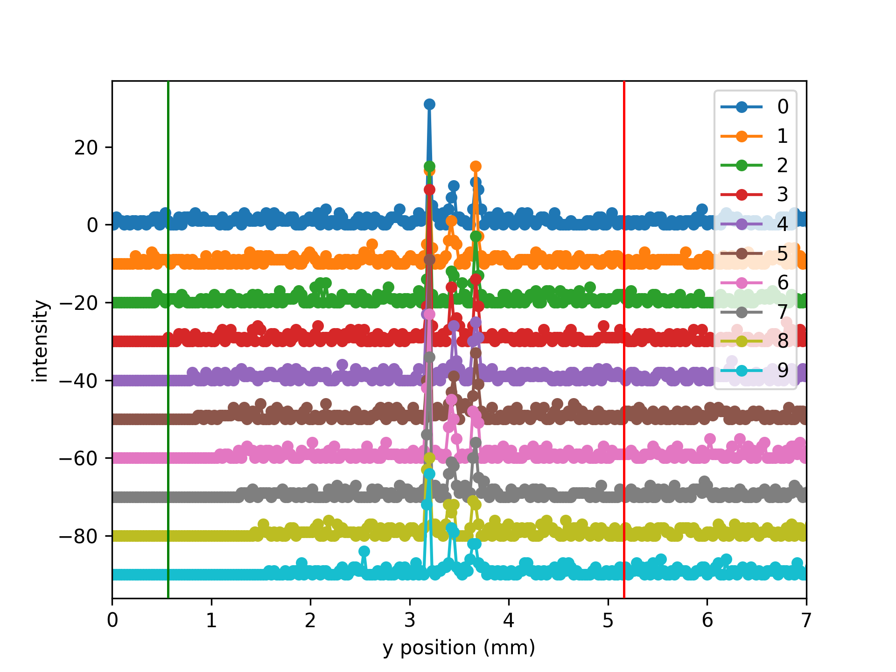
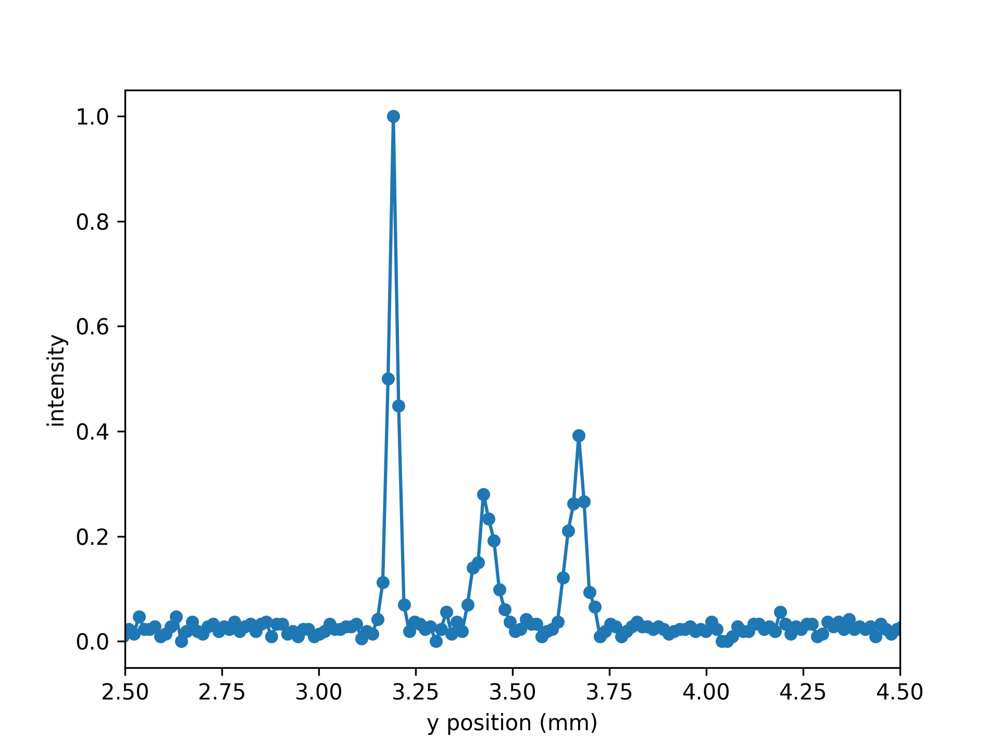

Example 1: Extract the spectrum of a dummy photon events list
==============================================================

Import modules.

>>> # brixs
>>> import brixs
>>>
>>> # standard libraries
>>> import matplotlib.pyplot as plt
>>> plt.ion()

Create a dummy generic photon events list,

>>> # simulating a generic spectrum
>>> I = brixs.dummy_spectrum(0, 0.2, excitations=[[0.5, 2, 2], [0.5, 4, 2]])
>>> # simulating the photon_event list(where we're using energy in eV's and length in meters)
>>> data = brixs.dummy_photon_events(I, background=0.02,
                                    noise=0.05,
                                    exposure=50e4,
                                    dispersion= 8.45 * (10**-3 / 10**-6),
                                    x_max=52.22e-3,
                                    y_max=25.73e-3,
                                    y_zero_energy=-20,
                                    angle=2,
                                    psf_fwhm=(3e-6, 1e-6))

Initializing ``photon_events`` object:

>>> # initializing photon_events object
>>> p = brixs.photon_events(data=data)
>>> # change length unit from m to mm
>>> p.apply_correction(lambda x, y: (x*10**3, y*10**3))
>>> # plotting data
>>> ax = p.plot()

Set binning and calculating offsets. Note that we have split the data in 10 columns
and 1000 rows. The plot only shows the columns edges.

>>> # set binning and calculating offsets
>>> p.set_binning((10, 1000))
>>> p.calculate_offsets(ranges=[[0.5666516987271235,  5.161124931649747]])
>>> p.fit_offsets()
>>> ax = p.plot(show_bins=(True, False), show_offsets=True, show_offsets_fit=True)

By plotting each column on top of each other we can see the misalignment of the
columns.

>>> # plot all columns
>>> ax = p.plot_columns(vertical_increment=10, show_ranges=True)
>>> ax.set_xlabel('y position (mm)')
>>> ax.set_ylabel('intensity')

After correction, the columns are aligned.

>>> # apply offset correction
>>> p.offsets_correction()
>>> # plot all columns after correction
>>> ax = p.plot_columns(vertical_increment=10, show_ranges=True)
>>> ax.set_xlabel('y position (mm)')
>>> ax.set_ylabel('intensity')

We can now calculate the final spectrum. For that, we temporarily increase the
y binning to 2000.

>>> # calculate spectrum
>>> p.calculate_spectrum(y_bins=2000)
>>> # plot final spectrum
>>> ax = p.spectrum.plot()
>>> ax.set_xlabel('y position (mm)')
>>> ax.set_ylabel('intensity')

