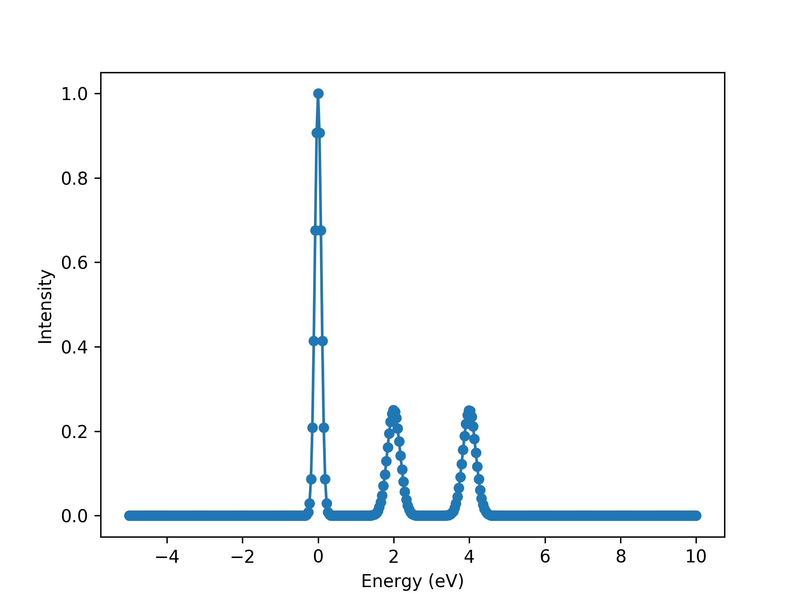
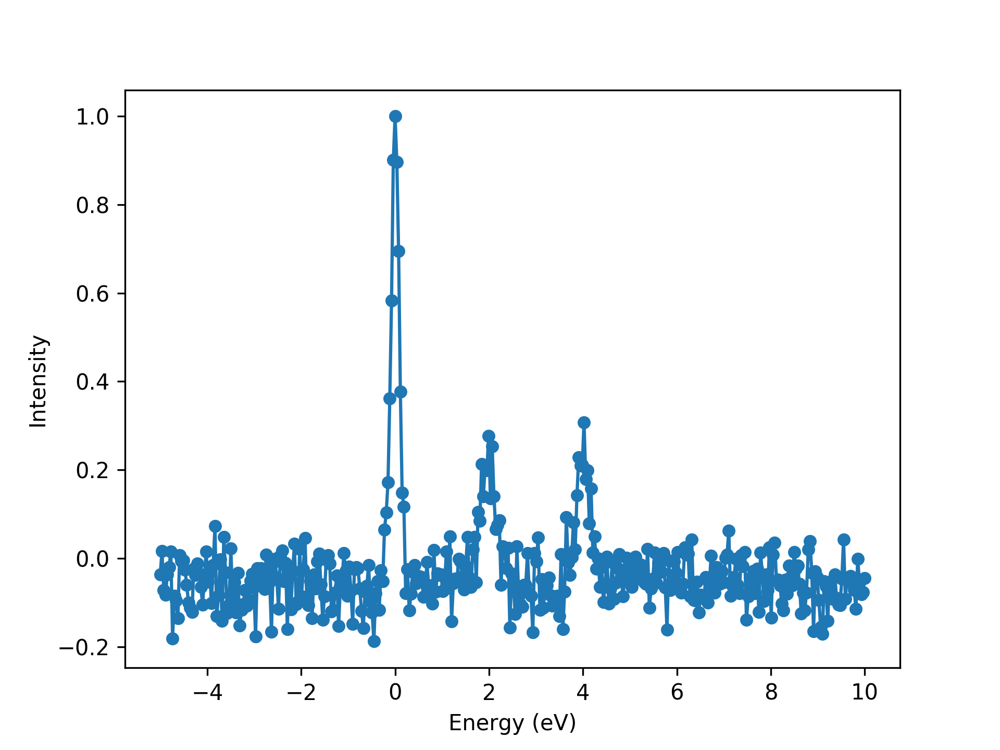
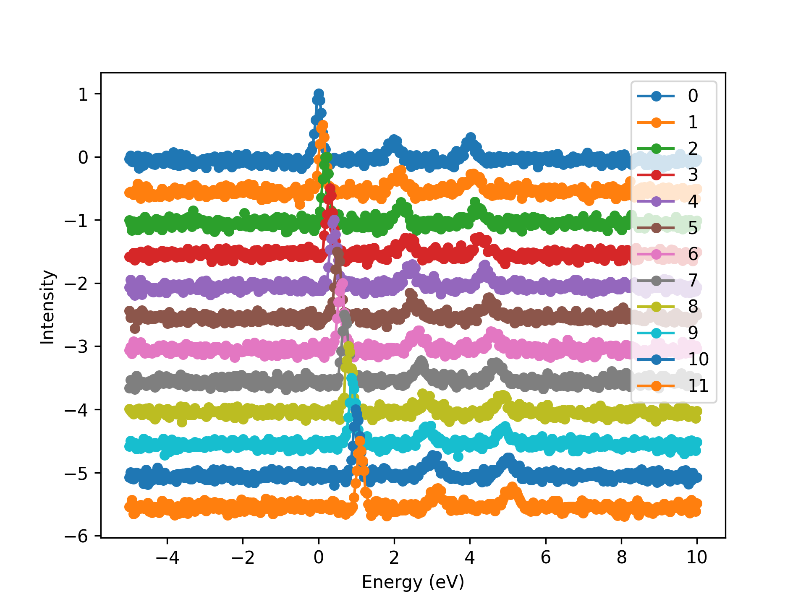
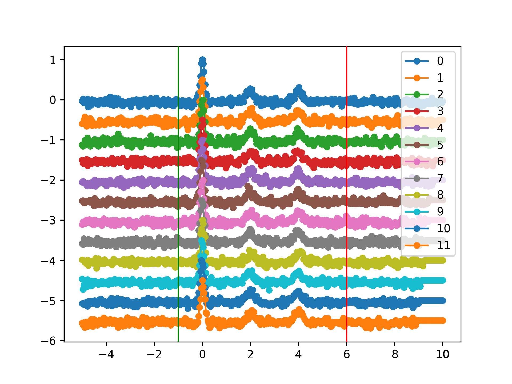
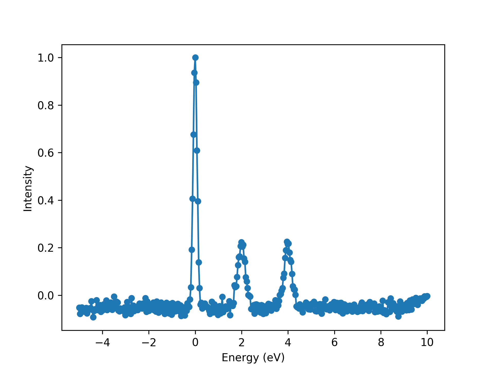

Example 2: Dealing with many spectra
======================================

Import modules.

>>> # brixs
>>> import brixs
>>>
>>> # standard libraries
>>> import numpy as np
>>> import matplotlib.pyplot as plt
>>> plt.ion()

Create a dummy list of spectra.

>>> # creating a dummy list of spectra with a misalignment between them
>>> x = np.linspace(-5, 10, 400) # energy (eV)
>>> data = []
>>> for i in range(12):
>>>     I = brixs.dummy_spectrum(0+i*0.1, 0.2, excitations=[[0.5, 2, 2], [0.5, 4, 2]])
>>>     spectrum = brixs.spectrum(data=np.column_stack((x, I(x))))
>>>     data.append(spectrum)

We now have a list with 12 spectrum objects.

>>> # data is list of 12 spectrum objects
>>> print(data)
# [<brixs.brixs.spectrum at 0x7f2fbc78e390>,
#  <brixs.brixs.spectrum at 0x7f2fbc78ee80>,
#  <brixs.brixs.spectrum at 0x7f2fbc78e2e8>,
#  <brixs.brixs.spectrum at 0x7f2fbc78e048>,
#  <brixs.brixs.spectrum at 0x7f2fbc78e6d8>,
#  <brixs.brixs.spectrum at 0x7f2fbc78ef28>,
#  <brixs.brixs.spectrum at 0x7f2fbc78e438>,
#  <brixs.brixs.spectrum at 0x7f2fbc78e160>,
#  <brixs.brixs.spectrum at 0x7f2fbc78e240>,
#  <brixs.brixs.spectrum at 0x7f2fbc78e0b8>,
#  <brixs.brixs.spectrum at 0x7f2fbc78e1d0>,
#  <brixs.brixs.spectrum at 0x7f2fbc78e518>]

Plot the first spectrum.

>>> # plot
>>> ax = data[0].plot()
>>> ax.set_xlabel('Energy (eV)')
>>> ax.set_ylabel('Intensity')

>>> # add random noise to the data
>>> for i in range(len(data)):
>>>     noise = np.random.normal(-0.05, 0.05, size=len(x))
>>>     f = lambda x, y: (x, y+noise)
>>>     data[i].apply_correction(f)

Plot the first spectrum now with noise.

>>> # plot
>>> ax = data[0].plot()
>>> ax.set_xlabel('Energy (eV)')
>>> ax.set_ylabel('Intensity')

Initialize ``spectra`` object.

>>> # initialize spectra object
>>> s = brixs.spectra(data=data)

Plot all spectra. Note the misalignment between different spectra.

>>> ax = s.plot(vertical_increment=0.5, show_ranges=True)
>>> ax.set_xlabel('Energy (eV)')
>>> ax.set_ylabel('Intensity')

Calculate the misalignment and apply correction.

>>> # calculate shifts
>>> s.calculate_shifts(ref=0, mode='cross-correlation', ranges=[[-1, 6]])
>>> s.shifts_correction()

Plot after correction.

>>> # plot after correction
>>> ax = s.plot(vertical_increment=0.5, show_ranges=True)

Sum all spectra and plot final spectrum.

>>> # calculate sum
>>> s.calculate_sum()
>>> ax = s.sum.plot()
>>> ax.set_xlabel('Energy (eV)')
>>> ax.set_ylabel('Intensity')

